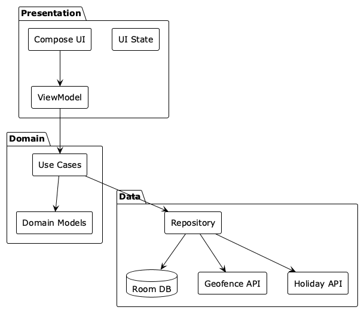

# Architecture

Go2Office follows **Clean Architecture** with **MVVM** pattern.

## Layers

## Components

### Presentation Layer
- **Screens**: Jetpack Compose UI
- **ViewModels**: Manage UI state, one per screen
- **Events**: User actions (sealed classes)
- **State**: Immutable data classes

**Flow**: User → Event → ViewModel → UseCase → State → UI Recomposes

### Domain Layer  
- **Use Cases**: Single-responsibility business operations
  - `GetMonthProgressUseCase`
  - `GetSuggestedDaysUseCase`
  - `CalculateRequirementsUseCase`
  - `AggregateSessionsUseCase`
- **Models**: Pure Kotlin entities (no Android dependencies)

### Data Layer
- **Repository**: Single source of truth
- **Room Database**: Local persistence
  - `OfficeSettingsEntity`
  - `DailyEntryEntity`
  - `OfficePresenceEntity` (geofence sessions)
  - `HolidayEntity`
- **API**: Nager.Date for public holidays
- **Geofencing**: Background location tracking

## Dependency Injection

**Hilt** provides:
- **SingletonComponent**: Database, Repository, Services
- **ViewModelComponent**: Use Cases injected into ViewModels

## Key Patterns

### Unidirectional Data Flow
User clicks → Event → ViewModel → UseCase → Repository → Database → State updates → UI recomposes

### State Management
Every screen has immutable state (data class) observed via StateFlow.

### Repository Pattern
Single source of truth abstracting Room, API, and Geofencing.

## Navigation

**Onboarding** (first launch) → **Dashboard** (main) → Settings / Calendar / Day Entry / Auto-Detection

## Background Processing

### Geofencing
- **BroadcastReceiver** handles geofence events
- Runs in <1 second, minimal battery impact
- Saves presence records (entry/exit times)
- Aggregates to daily entries automatically

### WorkManager
- Periodic sync for holiday data
- Cleans up old presence records
- Monthly requirement recalculation

## Testing Strategy

- **Unit Tests** (70%): ViewModels, Use Cases, business logic
- **Integration Tests** (20%): Repository + Room
- **UI Tests** (10%): Compose screens

## Tech Details

- **Language**: Kotlin
- **Min SDK**: 26 (Android 8.0)
- **Target SDK**: 36
- **Compose BOM**: 2024.11.00
- **Room**: 2.6.1
- **Hilt**: 2.51.1

