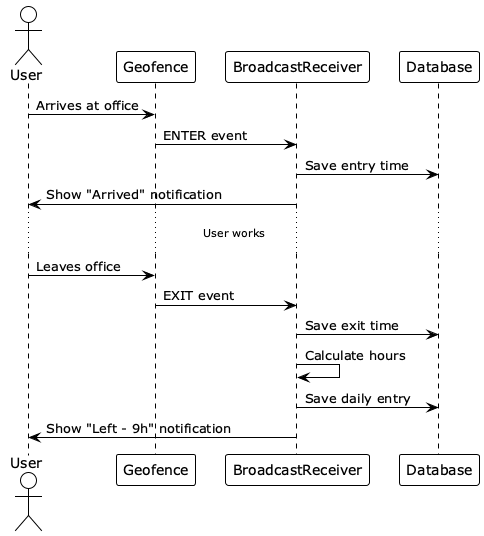
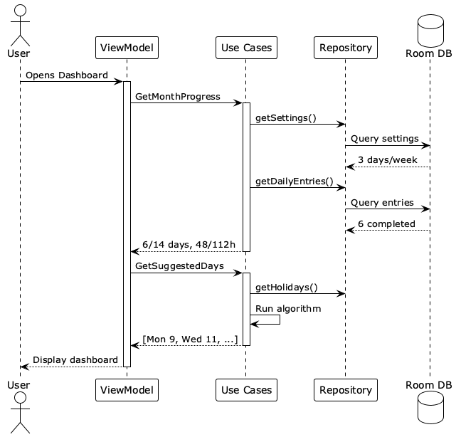

# Key Flows
## 1. Auto-Detection

Complete geofence-based tracking. When you arrive/leave office, the app automatically logs entry/exit times and calculates hours.
## 2. Dashboard Load

Opening the app loads current month progress (completed vs required) and suggests next optimal office days.
## 3. Manual Entry
User clicks a day → enters hours → saves → dashboard updates automatically.
## 4. Settings Update
Changing requirements (e.g., 3 to 4 days/week) automatically recalculates the dashboard.
## Data Flow
All data flows reactively:
```
Database → Flow → ViewModel → StateFlow → UI recomposes
```
Any change in the database automatically propagates to the UI.
