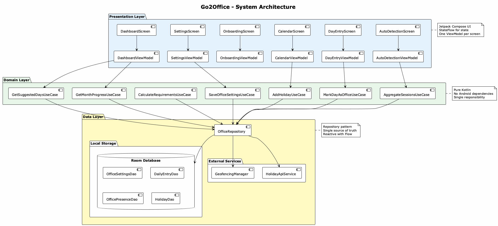
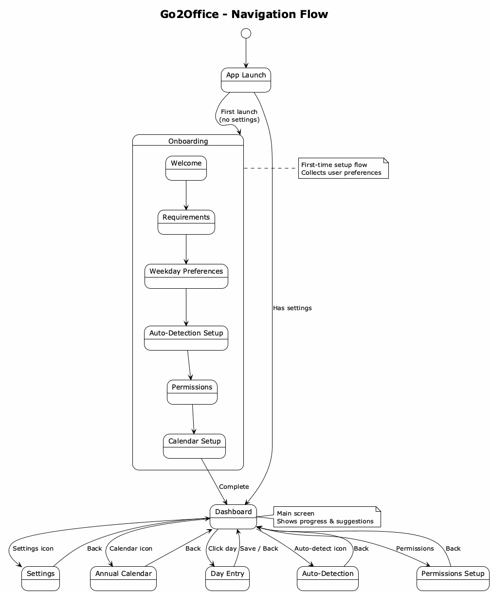
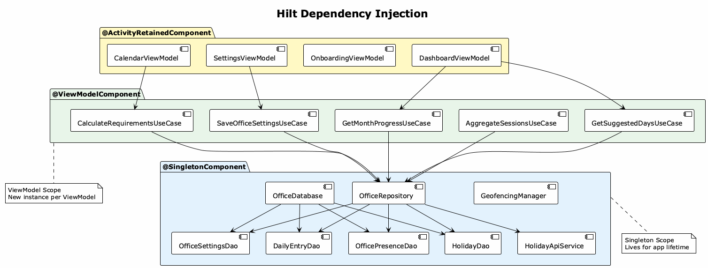
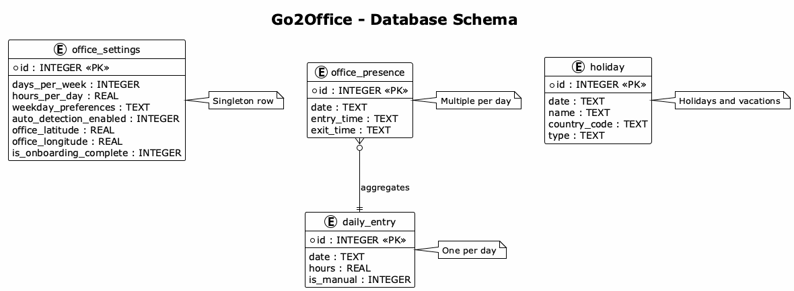

# Architecture

Go2Office follows **Clean Architecture** with **MVVM** pattern.

## System Overview

The app is organized into three layers:

| Layer | Responsibility | Components |
|-------|---------------|------------|
| **Presentation** | UI & state management | Screens, ViewModels |
| **Domain** | Business logic | Use Cases, Models |
| **Data** | Data access | Repository, DAOs, APIs |

## Data Flow

**Unidirectional data flow**:
1. User interacts with UI
2. UI sends events to ViewModel
3. ViewModel calls Use Cases
4. Use Cases access Repository
5. Repository queries Database
6. Data flows back up as StateFlow

## Navigation

- **Onboarding** → First launch setup
- **Dashboard** → Main hub
- **Settings/Calendar/DayEntry** → Secondary screens

## Dependency Injection

Using **Hilt** with scopes:
- `@SingletonComponent` - App lifetime (Database, Repository)
- `@ViewModelComponent` - ViewModel lifetime (Use Cases)

## Database Schema

**4 tables**:
- `office_settings` - User preferences (singleton)
- `daily_entry` - Hours per day
- `office_presence` - Entry/exit times
- `holiday` - Public holidays & vacations

