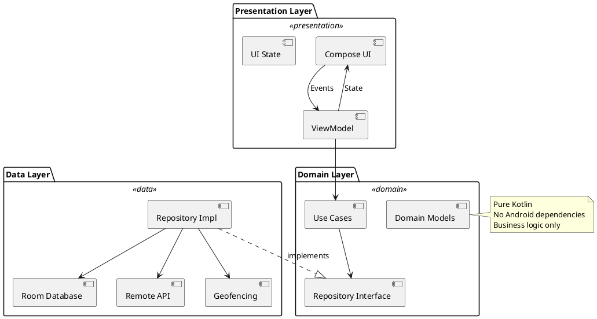
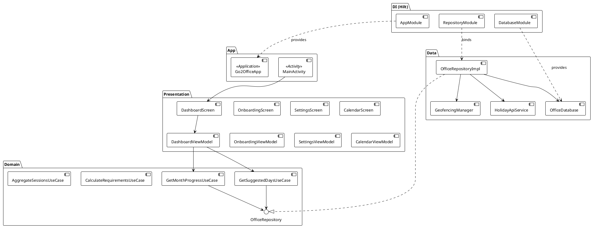
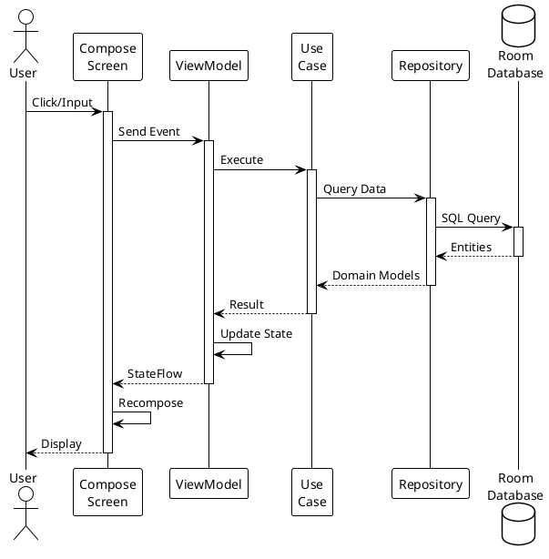
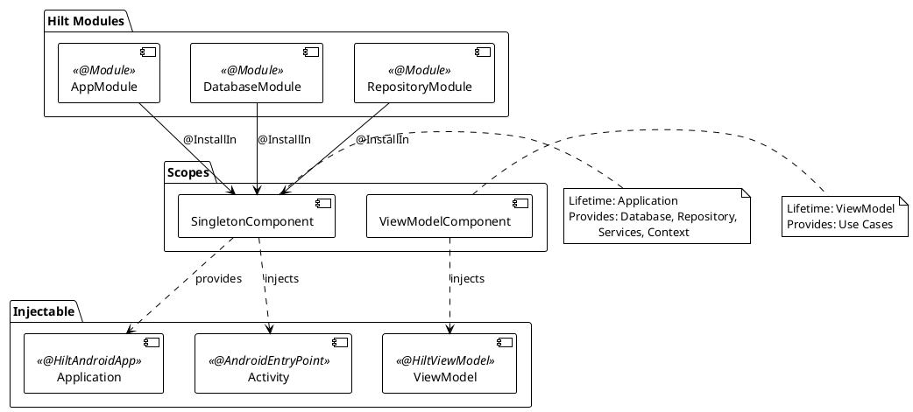
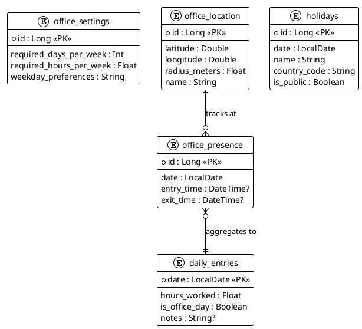
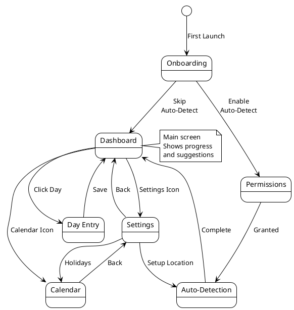
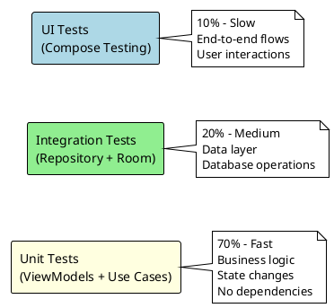

# 🏗️ Architecture Documentation

## Overview

Go2Office implements **Clean Architecture** with **MVVM** pattern, ensuring separation of concerns, testability, and maintainability.

---

## System Architecture


### High-Level Layers



---

## Layer Responsibilities

### 1. Presentation Layer

**Purpose**: User interface and user interaction handling

**Components**:
- **Composable Screens** - UI built with Jetpack Compose
- **ViewModels** - Manage UI state, coordinate use cases
- **UI State** - Immutable data classes
- **Events** - User actions (sealed classes)

**Flow**:
```
User Interaction → Event → ViewModel → Use Case → Update State → UI Recomposes
```

---

### 2. Domain Layer

**Purpose**: Business logic (framework-independent)

**Components**:
- **Use Cases** - Single-responsibility business operations
- **Domain Models** - Pure Kotlin business entities
- **Repository Interfaces** - Data access abstractions

**Principles**:
- ✅ No Android dependencies
- ✅ Pure Kotlin
- ✅ Easily testable
- ✅ Reusable

---

### 3. Data Layer

**Purpose**: Data persistence and external data sources

**Components**:
- **Repository Implementations** - Concrete data access
- **Room Database** - Local SQLite database
- **DAOs** - Data access objects
- **Remote APIs** - Holiday data service
- **Geofencing Service** - Location tracking

---

## Component Diagram



---

## Data Flow



---

## State Management

```plantuml
@startuml state-management
!theme plain

package "Unidirectional Data Flow" {
    state "UI State" as UIState
    state "User Event" as Event
    state "ViewModel" as VM
    state "Use Cases" as UC
    state "Repository" as Repo
    
    [*] --> UIState
    UIState --> Event : User\nInteraction
    Event --> VM : Handle\nEvent
    VM --> UC : Execute
    UC --> Repo : Query/Mutate
    Repo --> UC : Result
    UC --> VM : Success/Error
    VM --> UIState : Update\nState
    UIState --> UIState : UI\nRecomposes
}

note right of UIState
  Immutable data class
  Single source of truth
  Observed via StateFlow
end note

@enduml
```

---

## Dependency Injection



---

## Database Schema



---

## Navigation Flow



---

## Key Design Patterns

### 1. Repository Pattern
- Abstracts data sources
- Single source of truth
- Easy to swap implementations

### 2. Observer Pattern
- Flow/StateFlow for reactive data
- UI observes state changes
- Automatic updates

### 3. Dependency Injection
- Hilt for compile-time safety
- Singleton and ViewModelScoped
- Testability through interfaces

### 4. Use Case Pattern
- Single responsibility
- Reusable business logic
- Framework-independent

### 5. Mapper Pattern
- Separate data and domain models
- Clean layer boundaries
- Type safety

---

## Testing Strategy



---

## Performance Considerations

### Caching Strategy
- Room as single source of truth
- In-memory caching for calculations
- Flow-based reactive updates

### Background Processing
- Geofencing (system-managed, battery efficient)
- Coroutines for async operations
- No continuous polling

### UI Optimization
- LazyColumn for lists
- Remember/derivedStateOf for computations
- Immutable state for efficient recomposition

---

## Security

- All data stored locally (Room encrypted at rest)
- No cloud sync (privacy by design)
- Location permissions explicitly requested
- No analytics or tracking

---

## Scalability

### Current Support
- Single user
- Local data only
- No backend

### Future Extensions
- Multi-user support
- Cloud sync (optional)
- Team analytics
- API for HR systems

---

**See Also**:
- [Business Logic](../business/README.md)
- [Use Case Flows](../diagrams/use-case-flows.md)
- [API Documentation](../api/README.md)

