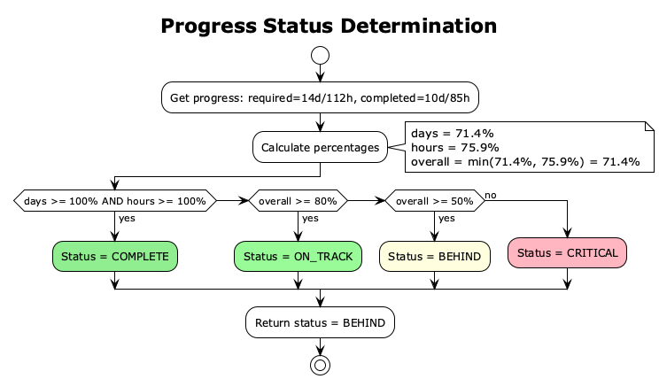

# Business Logic

Core algorithms and calculations in Go2Office.

## Monthly Requirements Calculation


### Formula

```
availableWeekdays = totalWeekdays - holidays - vacations
requiredDays = ceil((daysPerWeek × availableWeekdays) / 5)
requiredHours = requiredDays × hoursPerDay
```

### Example (March 2026)

| Input | Value |
|-------|-------|
| Days/week setting | 3 |
| Hours/day setting | 8 |
| Total weekdays in March | 22 |
| Public holidays | 1 |
| Vacation days | 5 |
| **Available weekdays** | 16 |
| **Required days** | ceil((3×16)/5) = **10** |
| **Required hours** | 10×8 = **80** |

## Smart Day Suggestions


The algorithm:
1. Calculate remaining days needed
2. Get available weekdays (exclude holidays, vacations, weekends, completed)
3. Group by week
4. Distribute evenly: `daysPerWeek = ceil(remaining / weeksLeft)`
5. Sort each week by user preference
6. Return chronologically sorted list

## Work Hours Tracking


### Rules

| Rule | Value |
|------|-------|
| Work window start | 7:00 AM |
| Work window end | 7:00 PM |
| Daily maximum | 10 hours |

### Examples

| Entry | Exit | Calculated Hours |
|-------|------|------------------|
| 8:30 AM | 5:45 PM | 9.25h |
| 6:00 AM | 3:00 PM | 8.0h (entry clamped to 7 AM) |
| 9:00 AM | 9:00 PM | 10.0h (exit clamped + capped) |

## Progress Status



| Status | Condition |
|--------|-----------|
| ✅ COMPLETE | Days ≥ 100% AND Hours ≥ 100% |
| 🟢 ON_TRACK | Overall ≥ 80% |
| 🟡 BEHIND | Overall ≥ 50% |
| 🔴 CRITICAL | Overall < 50% |

*Overall = min(daysProgress, hoursProgress)*

