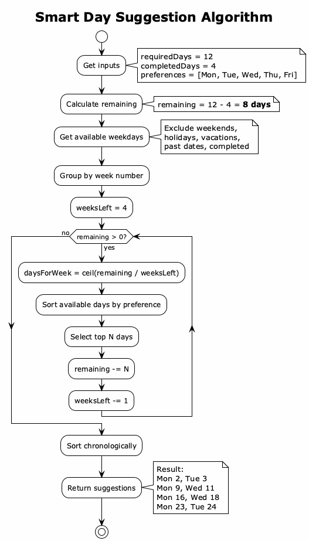
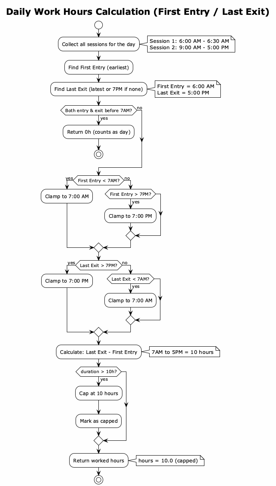
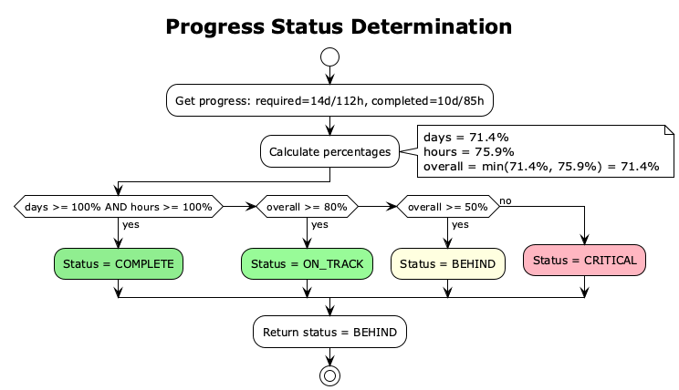

# Business Logic

Core algorithms and calculations in Go2Office.

## Monthly Requirements Calculation


### Formula

```
availableWeekdays = totalWeekdays - holidays - vacations
requiredDays = ceil((daysPerWeek × availableWeekdays) / 5)
requiredHours = requiredDays × hoursPerDay
```

### Example (March 2026)

| Input | Value |
|-------|-------|
| Days/week setting | 3 |
| Hours/day setting | 8 |
| Total weekdays in March | 22 |
| Public holidays | 1 |
| Vacation days | 5 |
| **Available weekdays** | 16 |
| **Required days** | ceil((3×16)/5) = **10** |
| **Required hours** | 10×8 = **80** |

## Smart Day Suggestions



The algorithm:
1. Calculate remaining days needed
2. Get available weekdays (exclude holidays, vacations, weekends, completed)
3. Group by week
4. Distribute evenly: `daysPerWeek = ceil(remaining / weeksLeft)`
5. Sort each week by user preference
6. Return chronologically sorted list

## Work Hours Tracking



### Time Calculation Logic

For any given day, the app calculates worked hours using:
- **First Entry**: The earliest entry time of the day
- **Last Exit**: The latest exit time of the day (or 7 PM if no exit)

Multiple sessions during the day are **aggregated** - only the first entry and last exit matter.

### Work Window Rules

| Rule | Value |
|------|-------|
| Work window start | 7:00 AM |
| Work window end | 7:00 PM |
| Daily maximum | 10 hours |

### Time Adjustments

| Condition | Adjustment |
|-----------|------------|
| Entry before 7 AM | Adjusted to 7:00 AM |
| Entry after 7 PM | Adjusted to 7:00 PM |
| Exit before 7 AM | Adjusted to 7:00 AM |
| Exit after 7 PM | Adjusted to 7:00 PM |
| No exit recorded | Defaults to 7:00 PM |

### Special Case

**Entry AND exit both before 7 AM** → Counts as a day present with **0 hours** worked.

### Formula

```
adjustedFirstEntry = clamp(firstEntry, 7AM, 7PM)
adjustedLastExit = clamp(lastExit ?? 7PM, 7AM, 7PM)
workedHours = min(adjustedLastExit - adjustedFirstEntry, 10h)
```

### Examples

| Sessions | First Entry | Last Exit | Adjusted Entry | Adjusted Exit | Hours |
|----------|-------------|-----------|----------------|---------------|-------|
| 9AM-5PM | 9:00 AM | 5:00 PM | 9:00 AM | 5:00 PM | 8h |
| 6AM-8AM, 9AM-5PM | 6:00 AM | 5:00 PM | 7:00 AM | 5:00 PM | 10h (capped) |
| 6AM-6:30AM | 6:00 AM | 6:30 AM | - | - | 0h (counts as day) |
| 8AM-9PM | 8:00 AM | 9:00 PM | 8:00 AM | 7:00 PM | 10h (capped) |
| 10AM (no exit) | 10:00 AM | - | 10:00 AM | 7:00 PM | 9h |
| 8PM-9PM | 8:00 PM | 9:00 PM | 7:00 PM | 7:00 PM | 0h |

## Progress Status



| Status | Condition |
|--------|-----------|
| ✅ COMPLETE | Days ≥ 100% AND Hours ≥ 100% |
| 🟢 ON_TRACK | Overall ≥ 80% |
| 🟡 BEHIND | Overall ≥ 50% |
| 🔴 CRITICAL | Overall < 50% |

*Overall = min(daysProgress, hoursProgress)*

