# 📊 Business Logic Documentation

> **📊 Viewing Diagrams**: This document uses **Mermaid diagrams** that render automatically on GitHub. Detailed PlantUML versions are in collapsible sections. See [diagrams/README.md](../diagrams/README.md) for more viewing options.

## Overview

This document explains the core business rules, calculations, and algorithms that power Go2Office.

---

## Monthly Requirements

### Required Days Calculation

**Business Rule**: User specifies days per week (e.g., 3 of 5). App calculates monthly requirement proportionally.

**Formula**:
```
requiredDays = ceil((daysPerWeek × weekdaysInMonth) / 5)
```

**PlantUML Diagram**:


**Example Calculations**:

| Month | Weekdays | 3 days/week | 4 days/week | 5 days/week |
|-------|----------|-------------|-------------|-------------|
| Jan 2026 | 22 | 14 days | 18 days | 22 days |
| Feb 2026 | 20 | 12 days | 16 days | 20 days |
| Mar 2026 | 22 | 14 days | 18 days | 22 days |

---

### Required Hours Calculation

**Business Rule**: Hours per day × required days

**Formula**:
```
requiredHours = daysPerWeek × hoursPerDay × weekdaysInMonth / 5
```

**Example**:
```
Settings: 3 days/week, 8 hours/day
March 2026: 22 weekdays

requiredHours = (3 × 8 × 22) / 5
              = 528 / 5
              = 105.6 hours
```

---

## Smart Suggestions Algorithm

### Goal
Suggest optimal office days that:
1. Respect user's weekday preferences
2. Distribute evenly across weeks
3. Avoid holidays and vacations
4. Adapt to current progress

### Algorithm Flow


### Example Scenario

**Setup**:
- Required: 12 days for March
- Completed: 4 days
- Remaining: 8 days
- Preferences: Mon > Tue > Wed > Thu > Fri
- Holiday: March 17 (Tuesday)

**Week-by-Week Distribution**:


**Result**: 8 days suggested, evenly distributed, respecting Monday preference

---

## Hour Tracking Rules

### Work Hours Window

**Business Rule**: Only hours between 7 AM and 7 PM count


### Examples

| Entry | Exit | Clamped Entry | Clamped Exit | Hours |
|-------|------|---------------|--------------|-------|
| 8:30 AM | 5:45 PM | 8:30 AM | 5:45 PM | 9.25h ✅ |
| 6:00 AM | 3:00 PM | 7:00 AM | 3:00 PM | 8.0h ✅ |
| 9:00 AM | 9:00 PM | 9:00 AM | 7:00 PM | 10.0h ✅ |
| 8:00 PM | 10:00 PM | - | - | 0.0h ❌ |
| 7:00 AM | 8:00 PM | 7:00 AM | 7:00 PM | 10.0h (capped) |

---

## Session Aggregation

**Business Rule**: Multiple office visits in one day are combined


---

## Holiday & Vacation Handling

### Exclusion Rules


### Impact on Requirements


---

## Progress Tracking

### Completion Calculation

```plantuml
@startuml progress-tracking
!theme plain

start
:Get required\ndays & hours;
:Get completed\ndays & hours;

:Calculate\ndays progress:;
note right
    daysProgress = (completed / required) × 100
end note

:Calculate\nhours progress:;
note right
    hoursProgress = (completed / required) × 100
end note

:Overall progress =\nmin(days%, hours%);

if (Days >= required\nAND hours >= required?) then (yes)
    :Status: COMPLETE ✅;
    stop
else (no)
    :Calculate days\nremaining;
    :Calculate hours\nremaining;
endif

if (Progress >= 80%?) then (yes)
    :Status: ON TRACK 🟢;
else if (Progress >= 50%?) then (yes)
    :Status: BEHIND 🟡;
else (no)
    :Status: CRITICAL 🔴;
endif

stop

@enduml
```



---

## Edge Cases

### Case 1: Insufficient Remaining Days


### Case 2: Mid-Month Settings Change

**Scenario**: User changes from 3 to 4 days/week on March 15

**Handling**:
1. Keep existing completed days
2. Recalculate requirement for remaining month
3. Adjust suggestions accordingly

```
Before change (Mar 1-15):
- Required: 7 days (first half)
- Completed: 6 days

After change (Mar 15-31):
- Remaining weekdays: 11
- New requirement: 4 days/week
- Additional needed: ceil((4 × 11) / 5) = 9 days

Total requirement: 6 (done) + 9 (remaining) = 15 days
```

### Case 3: Exceeded Hours but Not Days

**Scenario**: 
- Required: 12 days, 96 hours
- Completed: 10 days, 100 hours

**Handling**:
```
Days remaining: 2
Hours remaining: 0 (already exceeded)
Suggestions: 2 more days to meet day requirement
```

---

## Validation Rules

### Settings Validation

```plantuml
@startuml settings-validation
!theme plain

start
:User inputs\nsettings;

if (Days per week\n1-5?) then (no)
    :Error: "Must be 1-5";
    stop
endif

if (Hours per day\n1-12?) then (no)
    :Error: "Must be 1-12";
    stop
endif

if (5 unique\nweekdays?) then (no)
    :Error: "Must order\nall 5 weekdays";
    stop
endif

:Save settings ✅;
stop

@enduml
```



---

## Business Metrics

### Key Performance Indicators


---

## Calculation Examples

### Full Month Scenario

**User**: John Doe  
**Policy**: 3 days/week, 8 hours/day  
**Month**: March 2026 (22 weekdays)  
**Holidays**: March 17 (1 weekday)  
**Vacations**: March 24-28 (5 weekdays)

**Calculations**:
```
Base requirement:
- Days: ceil((3 × 22) / 5) = 14 days
- Hours: 14 × 8 = 112 hours

After holidays:
- Days: 14 - 1 = 13 days
- Hours: 13 × 8 = 104 hours

After vacations:
- Days: 13 - 5 = 8 days
- Hours: 8 × 8 = 64 hours

Final requirement:
- 8 days
- 64 hours
- Must be met by March 23
```

---

**See Also**:
- [Architecture](../architecture/README.md)
- [Use Case Flows](../diagrams/use-case-flows.md)
- [User Guide](../user-guide/README.md)

