# 🔄 Sequence Diagrams

This document contains detailed sequence diagrams for key user flows and system interactions.

---

## Table of Contents

1. [Auto-Detection Flow](#auto-detection-flow)
2. [Manual Day Entry](#manual-day-entry)
3. [Monthly Dashboard Load](#monthly-dashboard-load)
4. [Holiday Management](#holiday-management)
5. [Settings Update](#settings-update)

---

## Auto-Detection Flow

### Complete Office Visit Cycle

```plantuml
@startuml auto-detection-complete
!theme plain
title Auto-Detection: Complete Office Visit

actor User
participant "Android\nSystem" as System
participant "Geofence\nBroadcast\nReceiver" as Receiver
participant "Presence\nDAO" as DAO
participant "Room\nDatabase" as DB
participant "Notification\nHelper" as Notif
participant "Aggregate\nUseCase" as Aggregate

== User Arrives at Office ==

User -> System : Enters geofence area
activate System
System -> System : Detect ENTER event
System -> Receiver : onReceive(ENTER)
activate Receiver

Receiver -> DAO : insert(PresenceEntity\nwith entryTime)
activate DAO
DAO -> DB : INSERT entry
activate DB
DB --> DAO : Success
deactivate DB
DAO --> Receiver : Saved
deactivate DAO

Receiver -> Notif : showNotification\n("Arrived at office")
activate Notif
Notif --> User : 🔔 "Arrived at office\n8:30 AM"
deactivate Notif

Receiver --> System : Complete
deactivate Receiver
deactivate System

== User Works (App Sleeps) ==

User -> User : Works for several hours
note right: No app activity\nNo battery drain

== User Leaves Office ==

User -> System : Exits geofence area
activate System
System -> System : Detect EXIT event
System -> Receiver : onReceive(EXIT)
activate Receiver

Receiver -> DAO : insert(PresenceEntity\nwith exitTime)
activate DAO
DAO -> DB : INSERT exit
activate DB
DB --> DAO : Success
deactivate DB
DAO --> Receiver : Saved
deactivate DAO

Receiver -> Aggregate : aggregateSessions(date)
activate Aggregate
Aggregate -> DAO : getSessionsForDate(date)
activate DAO
DAO -> DB : SELECT * WHERE date
DB --> DAO : [entry, exit]
DAO --> Aggregate : List<PresenceEntity>
deactivate DAO

Aggregate -> Aggregate : Calculate hours\n(7 AM - 7 PM window)
Aggregate -> Aggregate : Apply 10h daily cap

Aggregate -> DAO : saveDailyEntry(date, hours)
activate DAO
DAO -> DB : INSERT daily_entry
DB --> DAO : Success
deactivate DAO
Aggregate --> Receiver : Hours: 9.25
deactivate Aggregate

Receiver -> Notif : showNotification\n("Left office - 9.2h")
activate Notif
Notif --> User : 🔔 "Left office\n9.2 hours worked"
deactivate Notif

Receiver --> System : Complete
deactivate Receiver
deactivate System

== Next Day Dashboard Check ==

User -> User : Opens app
note right: Dashboard shows\nyesterday's 9.2h\nautomatically

@enduml
```

---

## Manual Day Entry

### User Manually Logs Office Day

---

## Monthly Dashboard Load

### Dashboard Screen Initialization

---

## Holiday Management

### Load Country Holidays

```plantuml
@startuml load-holidays
!theme plain
title Load Country Holidays from API

actor User
participant "Calendar\nScreen" as Screen
participant "Calendar\nViewModel" as VM
participant "Add Holiday\nUseCase" as AddUC
participant "Repository" as Repo
participant "Holiday\nAPI Service" as API
participant "Room\nDatabase" as DB

User -> Screen : Tap "Load Country"
activate Screen
Screen --> User : Show country picker
User -> Screen : Select "Portugal"
Screen -> VM : onEvent(LoadCountry("PT"))
activate VM

VM -> VM : Update state\n(loading = true)
VM --> Screen : Show loading
Screen --> User : 🔄 Loading...

VM -> Repo : fetchPublicHolidays("PT", 2026)
activate Repo

Repo -> API : GET /PublicHolidays/2026/PT
activate API
API --> Repo : JSON response\n[{date, name}...]
deactivate API

Repo -> Repo : Map DTOs to\nHolidayEntity

loop For each holiday
    Repo -> DB : INSERT holiday
    activate DB
    DB --> Repo : Saved
    deactivate DB
end

Repo --> VM : Result.success\n(10 holidays loaded)
deactivate Repo

VM -> VM : Update state:\n- loading = false\n- success message

VM --> Screen : State updated
deactivate VM

Screen -> Screen : Recompose calendar

Screen --> User : Show holidays\nmarked with 🎉
deactivate Screen

note over User
Calendar now shows:
- 1 Jan: New Year
- 25 Apr: Freedom Day
- 10 Jun: Portugal Day
etc.
end note

@enduml
```

---

## Settings Update

### Change Requirements Mid-Month

```plantuml
@startuml settings-update
!theme plain
title Update Settings and Recalculate

actor User
participant "Settings\nScreen" as Screen
participant "Settings\nViewModel" as VM
participant "Save Settings\nUseCase" as SaveUC
participant "Repository" as Repo
participant "Room\nDatabase" as DB
participant "Dashboard\nViewModel" as DashVM

User -> Screen : Open Settings
activate Screen
Screen -> VM : Load current settings
activate VM
VM -> Repo : getSettings()
activate Repo
Repo -> DB : SELECT settings
DB --> Repo : Current settings
Repo --> VM : OfficeSettings\n(3 days/week)
deactivate Repo
VM --> Screen : Display current
Screen --> User : Show: 3 days/week

User -> Screen : Change to 4 days/week
User -> Screen : Tap "Save"
Screen -> VM : onEvent(UpdateSettings\n(4 days/week))

VM -> VM : Validate:\n- Days 1-5 ✓\n- Hours 1-12 ✓

VM -> SaveUC : execute(newSettings)
activate SaveUC
SaveUC -> Repo : saveSettings\n(4 days/week)
activate Repo
Repo -> DB : UPDATE settings
activate DB
DB --> Repo : Updated
deactivate DB
Repo --> SaveUC : Success
deactivate Repo
SaveUC --> VM : Result.success
deactivate SaveUC

VM -> VM : Update state\n(saved = true)
VM --> Screen : Show "Saved ✓"
deactivate VM
Screen --> User : Settings updated

== Dashboard Auto-Recalculates ==

DB -> Repo : Settings changed\n(Flow emits)
activate Repo
Repo -> DashVM : Flow<Settings>
activate DashVM

DashVM -> DashVM : observeSettings() {\n  loadDashboardData()\n}

note over DashVM
Dashboard ViewModel
observes settings Flow
and reloads data when
settings change
end note

DashVM -> DashVM : Recalculate:\n- Requirements\n- Suggestions

DashVM --> Repo : New state ready
deactivate DashVM
deactivate Repo

note over User
Next time user opens
Dashboard, new requirements
are automatically shown
end note

deactivate Screen

@enduml
```

---

## Background Processing

### Geofence Event Handling

---

## Error Handling

### Failed API Call Recovery

---

**See Also**:
- [Architecture](../architecture/README.md)
- [Business Logic](../business/README.md)
- [Use Cases](../api/README.md)

