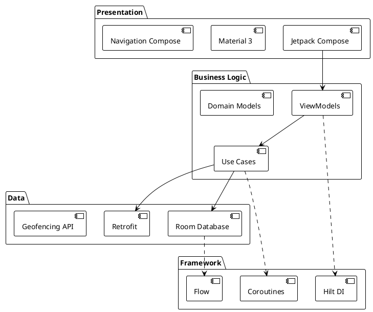

# 🔧 Technical Guide

Development, build, and deployment guide for Go2Office.

---

## Development Setup

### Prerequisites

```bash
# Required
- Android Studio Hedgehog (2023.1.1) or later
- JDK 11 or higher
- Android SDK API 26-36
- Git

# Recommended
- Android device with location services
- Android emulator with Google Play services
```

### Clone and Build

```bash
# Clone repository
git clone https://github.com/yourusername/Go2Office.git
cd Go2Office

# Build debug APK
./gradlew assembleDebug

# Install on device
./gradlew installDebug

# Run all tests
./gradlew test
./gradlew connectedAndroidTest
```

---

## Project Configuration

### Build Variants

```kotlin
// app/build.gradle.kts

android {
    buildTypes {
        debug {
            isDebuggable = true
            applicationIdSuffix = ".debug"
            versionNameSuffix = "-DEBUG"
        }
        
        release {
            isMinifyEnabled = true
            isShrinkResources = true
            proguardFiles(
                getDefaultProguardFile("proguard-android-optimize.txt"),
                "proguard-rules.pro"
            )
        }
    }
}
```

### Dependencies (Key Libraries)

```kotlin
dependencies {
    // Core
    implementation("androidx.core:core-ktx:1.12.0")
    implementation("androidx.lifecycle:lifecycle-runtime-ktx:2.7.0")
    
    // Compose
    implementation(platform("androidx.compose:compose-bom:2024.02.00"))
    implementation("androidx.compose.ui:ui")
    implementation("androidx.compose.material3:material3")
    
    // Navigation
    implementation("androidx.navigation:navigation-compose:2.7.7")
    
    // Hilt
    implementation("com.google.dagger:hilt-android:2.50")
    ksp("com.google.dagger:hilt-compiler:2.50")
    
    // Room
    implementation("androidx.room:room-runtime:2.6.1")
    implementation("androidx.room:room-ktx:2.6.1")
    ksp("androidx.room:room-compiler:2.6.1")
    
    // Location
    implementation("com.google.android.gms:play-services-location:21.1.0")
    
    // Testing
    testImplementation("junit:junit:4.13.2")
    testImplementation("org.robolectric:robolectric:4.11.1")
    androidTestImplementation("androidx.compose.ui:ui-test-junit4")
}
```

---

## Architecture Overview


*Technology stack showing presentation, business logic, data, and framework layers*

<details>
<summary>📄 View PlantUML source</summary>



</details>

---

## Testing

### Unit Tests

```bash
# Run all unit tests
./gradlew test

# Run specific test class
./gradlew test --tests GetMonthProgressUseCaseTest

# With coverage
./gradlew testDebugUnitTest jacocoTestReport
```

**Test Structure**:
```
app/src/test/
├── domain/usecase/
│   ├── GetMonthProgressUseCaseTest.kt
│   ├── GetSuggestedDaysUseCaseTest.kt
│   └── CalculateRequirementsUseCaseTest.kt
├── presentation/
│   ├── dashboard/DashboardViewModelTest.kt
│   └── settings/SettingsViewModelTest.kt
└── util/
    ├── DateUtilsTest.kt
    └── WorkHoursCalculatorTest.kt
```

### Instrumented Tests

```bash
# Run on connected device/emulator
./gradlew connectedAndroidTest

# Run specific test
./gradlew connectedAndroidTest -Pandroid.testInstrumentationRunnerArguments.class=com.example.go2office.DashboardScreenTest
```

---

## Database Migrations

### Adding New Column

```kotlin
// 1. Update Entity
@Entity(tableName = "daily_entries")
data class DailyEntryEntity(
    @PrimaryKey val date: LocalDate,
    val hoursWorked: Float,
    val isOfficeDay: Boolean,
    val notes: String? = null,
    val isManualEntry: Boolean = false  // NEW COLUMN
)

// 2. Increment version
@Database(
    entities = [DailyEntryEntity::class, ...],
    version = 2,  // Increment
    exportSchema = true
)
abstract class OfficeDatabase : RoomDatabase()

// 3. Add migration
val MIGRATION_1_2 = object : Migration(1, 2) {
    override fun migrate(database: SupportSQLiteDatabase) {
        database.execSQL(
            "ALTER TABLE daily_entries ADD COLUMN is_manual_entry INTEGER NOT NULL DEFAULT 0"
        )
    }
}

// 4. Register migration
Room.databaseBuilder(context, OfficeDatabase::class.java, "office_database")
    .addMigrations(MIGRATION_1_2)
    .build()
```

---

## Building for Production

### Release Build

```bash
# Generate release APK
./gradlew assembleRelease

# Output: app/build/outputs/apk/release/app-release.apk
```

### Signing Configuration

```kotlin
// local.properties (not in version control)
RELEASE_STORE_FILE=../keystore/release.keystore
RELEASE_STORE_PASSWORD=***
RELEASE_KEY_ALIAS=go2office
RELEASE_KEY_PASSWORD=***

// build.gradle.kts
android {
    signingConfigs {
        create("release") {
            storeFile = file(properties["RELEASE_STORE_FILE"])
            storePassword = properties["RELEASE_STORE_PASSWORD"]
            keyAlias = properties["RELEASE_KEY_ALIAS"]
            keyPassword = properties["RELEASE_KEY_PASSWORD"]
        }
    }
    
    buildTypes {
        release {
            signingConfig = signingConfigs.getByName("release")
        }
    }
}
```

### ProGuard Rules

```proguard
# Room
-keep class * extends androidx.room.RoomDatabase
-keep @androidx.room.Entity class *
-dontwarn androidx.room.paging.**

# Hilt
-dontwarn com.google.errorprone.annotations.**
-keep class dagger.hilt.** { *; }

# Kotlinx Serialization
-keepattributes *Annotation*, InnerClasses
-keep,includedescriptorclasses class com.example.go2office.**$$serializer { *; }

# Coroutines
-keepnames class kotlinx.coroutines.internal.MainDispatcherFactory {}
-keepclassmembers class kotlinx.coroutines.** {
    volatile <fields>;
}
```

---

## Performance Optimization

### Database Optimization

```kotlin
// Use indices for frequent queries
@Entity(
    tableName = "daily_entries",
    indices = [Index(value = ["date"], unique = true)]
)

// Batch operations
@Transaction
suspend fun insertMultiple(entries: List<DailyEntryEntity>) {
    entries.forEach { insert(it) }
}

// Paging for large datasets
@Query("SELECT * FROM daily_entries ORDER BY date DESC")
fun getAllPaged(): PagingSource<Int, DailyEntryEntity>
```

### Compose Optimization

```kotlin
// Remember expensive calculations
@Composable
fun DashboardScreen(viewModel: DashboardViewModel) {
    val uiState by viewModel.uiState.collectAsState()
    
    // ✅ Remember derived state
    val progressPercentage = remember(uiState.monthProgress) {
        uiState.monthProgress?.let { 
            (it.completedDays.toFloat() / it.requiredDays) * 100 
        } ?: 0f
    }
    
    // ✅ Stable keys for LazyColumn
    LazyColumn {
        items(
            items = uiState.suggestedDays,
            key = { it.date.toString() }  // Stable key
        ) { day ->
            DayCard(day)
        }
    }
}
```

---

## Debugging

### Enable Logging

```kotlin
// BuildConfig
android {
    buildTypes {
        debug {
            buildConfigField("boolean", "DEBUG_MODE", "true")
        }
        release {
            buildConfigField("boolean", "DEBUG_MODE", "false")
        }
    }
}

// Usage
if (BuildConfig.DEBUG_MODE) {
    Log.d("Go2Office", "Geofence entered at ${System.currentTimeMillis()}")
}
```

### Database Inspector

1. Run app in debug mode
2. Android Studio → View → Tool Windows → App Inspection
3. Select "Database Inspector"
4. Explore tables, run queries

### Compose Layout Inspector

1. Android Studio → Tools → Layout Inspector
2. Select running app
3. Inspect composable tree
4. View recomposition counts

---

## CI/CD

### GitHub Actions

```yaml
# .github/workflows/android.yml
name: Android CI

on:
  push:
    branches: [ main ]
  pull_request:
    branches: [ main ]

jobs:
  build:
    runs-on: ubuntu-latest
    
    steps:
    - uses: actions/checkout@v3
    
    - name: Set up JDK 11
      uses: actions/setup-java@v3
      with:
        java-version: '11'
        distribution: 'temurin'
    
    - name: Grant execute permission for gradlew
      run: chmod +x gradlew
    
    - name: Build with Gradle
      run: ./gradlew build
    
    - name: Run tests
      run: ./gradlew test
    
    - name: Upload APK
      uses: actions/upload-artifact@v3
      with:
        name: app-debug
        path: app/build/outputs/apk/debug/app-debug.apk
```

---

## Monitoring & Analytics

### Crash Reporting (Optional)

```kotlin
// Firebase Crashlytics (example)
dependencies {
    implementation(platform("com.google.firebase:firebase-bom:32.7.2"))
    implementation("com.google.firebase:firebase-crashlytics-ktx")
}

// Usage
try {
    // Risky operation
} catch (e: Exception) {
    FirebaseCrashlytics.getInstance().recordException(e)
    // Handle error
}
```

### Performance Monitoring

```kotlin
// Track slow operations
suspend fun <T> trackPerformance(
    operationName: String,
    block: suspend () -> T
): T {
    val startTime = System.currentTimeMillis()
    return try {
        block()
    } finally {
        val duration = System.currentTimeMillis() - startTime
        if (duration > 1000) {
            Log.w("Performance", "$operationName took ${duration}ms")
        }
    }
}
```

---

## Deployment

### Google Play Console

1. **Create App**:
   - App name: Go2Office
   - Category: Productivity
   - Content rating: Everyone

2. **App Content**:
   - Privacy policy URL
   - Target audience
   - Content declarations

3. **Release**:
   - Internal testing → Alpha → Beta → Production
   - Upload AAB: `./gradlew bundleRelease`

4. **Store Listing**:
   - Screenshots (phone, tablet)
   - Feature graphic
   - Short/full description
   - Icon

---

## Versioning

### Semantic Versioning

```
MAJOR.MINOR.PATCH

1.0.0 - Initial release
1.1.0 - Add auto-detection
1.1.1 - Fix geofencing bug
2.0.0 - Breaking: New database schema
```

### Version Code

```kotlin
android {
    defaultConfig {
        versionCode = 1  // Increment for each release
        versionName = "1.0.0"  // Human-readable
    }
}
```

---

## Security Checklist

- [ ] No API keys in code (use BuildConfig)
- [ ] ProGuard enabled for release
- [ ] Room database encrypted (optional)
- [ ] HTTPS only for network calls
- [ ] Location permission justification in manifest
- [ ] No sensitive data in logs (release build)
- [ ] Code signing with production keystore

---

## Useful Commands

```bash
# Clean build
./gradlew clean

# Lint check
./gradlew lint

# Dependency updates
./gradlew dependencyUpdates

# Generate documentation
./gradlew dokkaHtml

# List tasks
./gradlew tasks

# Build and install
./gradlew installDebug

# Uninstall
./gradlew uninstallDebug
```

---

**See Also**:
- [Architecture](../architecture/README.md)
- [API Reference](../api/README.md)
- [Contributing](../../CONTRIBUTING.md)

