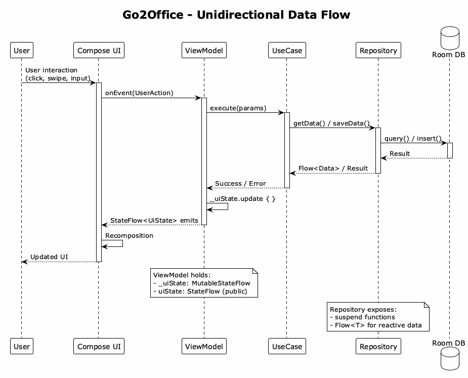
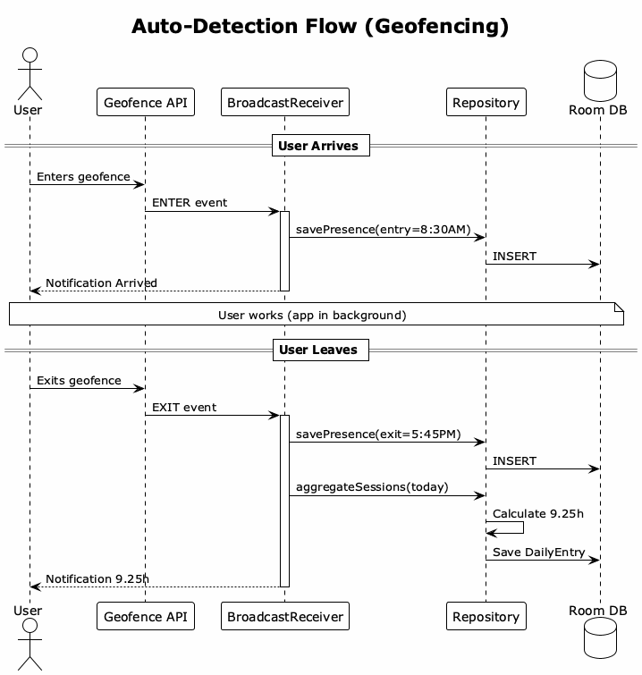

# User Guide

How to use Go2Office.

## First Time Setup

### Steps

1. **Days per week** - How many days required at office (1-5)
2. **Hours per day** - Expected hours per office day (1-12)
3. **Weekday preferences** - Order days by preference (drag to reorder)
4. **Auto-detection** - Enable GPS tracking (optional)
5. **Holidays** - Load country's public holidays

## Dashboard

The main screen shows:

| Section | Information |
|---------|-------------|
| **Progress** | Days completed vs required |
| **Hours** | Hours completed vs required |
| **Suggestions** | Next recommended office days |
| **Status** | ON_TRACK / BEHIND / CRITICAL |

## Auto-Detection

When enabled:
- App detects when you arrive/leave office via GPS
- Automatically logs entry and exit times
- Calculates hours worked (7 AM - 7 PM window)
- Caps at 10 hours per day

**Battery impact**: Minimal - uses passive geofencing.

## Manual Entry

If auto-detection is off, manually log hours:
1. Tap a day on the dashboard
2. Enter hours worked
3. Save

## Annual Calendar

Manage holidays and vacations:
- **Load holidays** - Select country to import public holidays
- **Add vacation** - Mark days you won't work
- **Remove** - Delete holidays or vacations

## Settings

Update your requirements anytime:
- Days per week
- Hours per day
- Weekday preferences
- Auto-detection toggle
- Office location

