# 📱 User Guide

Complete guide to using Go2Office effectively.

---

## Getting Started

### Installation

1. Download from Google Play (or build from source)
2. Grant location permissions when prompted
3. Complete the 30-second setup

### First-Time Setup


---

## Main Features

### 1. Dashboard

**Purpose**: Monitor monthly progress and see what's next

**What You See**:
- **Progress Ring**: Visual indicator of completion
- **Required vs. Completed**: Days and hours breakdown
- **Suggested Days**: Smart recommendations
- **Current Status**: On Track 🟢 / Behind 🟡 / Critical 🔴

**Actions**:
- Tap a day to log hours manually
- Pull to refresh
- Swipe to change month

---

### 2. Auto-Detection

**Purpose**: Automatically track office visits

**How It Works**:
1. You set your office location once
2. App creates a geofence (virtual perimeter)
3. When you enter → records arrival time
4. When you exit → records departure, calculates hours
5. Notification shows your hours for the day

**Setup**:
```
Settings → Auto-Detection → Enable
→ Set Location (GPS or manual)
→ Grant "Always Allow" location permission
```

**Battery Impact**: Minimal (~1-2% per day)

---

### 3. Smart Suggestions

**Purpose**: Know which days to work in office

**Algorithm Considers**:
- ✅ Your weekday preferences (Mon > Tue...)
- ✅ Public holidays
- ✅ Your vacation days
- ✅ Days already completed
- ✅ Even distribution across weeks

**Example**:
```
You need: 8 more days in March
Preferences: Monday first
Suggestions:
  → Mon, Mar 9
  → Mon, Mar 16
  → Mon, Mar 23
  → Tue, Mar 10
  → Tue, Mar 17
  ...
```

---

### 4. Holiday Management

**Purpose**: Load holidays and plan vacations

**Load Country Holidays** (100+ countries, FREE):
1. Calendar → Load Country
2. Select your country
3. All public holidays loaded automatically

**Add Personal Vacation**:
1. Calendar → Tap date
2. Select "Vacation"
3. Add description (optional)

**Effect on Requirements**:
- Holidays and vacations reduce your monthly requirement
- Suggestions automatically avoid these days

---

### 5. Manual Entry

**When to Use**:
- Auto-detection disabled
- Missed entry/exit
- Override automatic hours

**How**:
1. Dashboard → Tap any day
2. Enter hours (0-10)
3. Add notes (optional)
4. Save

---

## Common Workflows

### Scenario 1: New Month Planning


---

### Scenario 2: Mid-Month Check-In


---

### Scenario 3: Month-End Rush

```plantuml
@startuml month-end
!theme plain

start
:Last week of month;
:Open Dashboard;
if (Requirement met?) then (yes)
    :Celebrate! 🎉;
    stop
else (no)
    :Check days remaining;
    if (Enough days?) then (yes)
        :Work suggested days;
        stop
    else (no)
        :Work ALL remaining days;
        :Talk to manager\nabout shortage;
        stop
    endif
endif

@enduml
```



---

## Tips & Best Practices

### 1. Set It Up Once
- Enable auto-detection
- Load your country's holidays
- Add known vacation days
- Let the app handle the rest

### 2. Check Weekly
- Open app once a week
- Verify auto-detected hours
- Adjust upcoming plans if needed

### 3. Follow Suggestions
- App optimizes for your preferences
- Spreads days evenly
- Reduces last-minute scrambling

### 4. Plan Vacations Early
- Add vacation days as soon as you know
- App recalculates requirements automatically

### 5. Trust the Data
- All calculations are precise
- Hour tracking follows company rules (7 AM - 7 PM)
- Daily cap protects you (10h max)

---

## Troubleshooting

### Auto-Detection Not Working

**Problem**: No automatic tracking

**Solutions**:
1. Check location permission: Settings → Permissions → "Always Allow"
2. Verify location services enabled on phone
3. Check office location radius (try increasing to 200m)
4. Disable battery optimization for Go2Office
5. Restart app

---

### Wrong Hours Calculated

**Problem**: Hours don't match reality

**Why**: App enforces rules:
- Only 7 AM - 7 PM counts
- Maximum 10 hours per day
- Rounds to nearest 0.25 hour

**Solution**: 
- Review your entry/exit times
- Manually adjust if needed
- Check if you left before 7 AM or after 7 PM

---

### Suggestions Not Helpful

**Problem**: Suggested days don't fit schedule

**Solutions**:
1. Update weekday preferences (Settings)
2. Add vacation/off days
3. Ignore suggestions and manually plan
4. Suggestions adapt as you log days

---

### Can't Load Holidays

**Problem**: Holiday API fails

**Solutions**:
1. Check internet connection
2. Try again later (API may be down)
3. Manually add holidays: Calendar → Add Holiday
4. Use cached holidays (auto-loaded if available)

---

## Settings Reference

### Requirements
- **Days per week**: 1-5 (how many days you must work in office)
- **Hours per day**: 1-12 (expected hours per office day)

### Weekday Preferences
- Order Monday-Friday by preference
- Affects suggestion algorithm
- Drag to reorder

### Auto-Detection
- **Enable/Disable**: Toggle automatic tracking
- **Office Location**: GPS coordinates + radius
- **Notifications**: Show entry/exit alerts

### Holidays
- **Load Country**: Fetch public holidays (free API)
- **Manage Vacations**: Add/remove personal days off

---

## Keyboard Shortcuts (Future)

| Shortcut | Action |
|----------|--------|
| `Space` | Quick add today |
| `←` / `→` | Previous/Next month |
| `R` | Refresh data |
| `S` | Open settings |

---

## FAQ

**Q: Does the app share my location?**  
A: No. All data stays on your device. No cloud sync.

**Q: What if I forget to enable auto-detection?**  
A: Manually log hours anytime. Auto-detection is optional.

**Q: Can I use for multiple jobs/offices?**  
A: Currently supports one office. Multi-office coming soon.

**Q: Does it work offline?**  
A: Yes. Only holiday loading needs internet.

**Q: What if my requirements change?**  
A: Update Settings anytime. App recalculates automatically.

**Q: Can my manager see my data?**  
A: No. This is your personal tracking tool.

---

**See Also**:
- [Architecture](../architecture/README.md)
- [Business Logic](../business/README.md)
- [Technical Guide](../technical/README.md)

